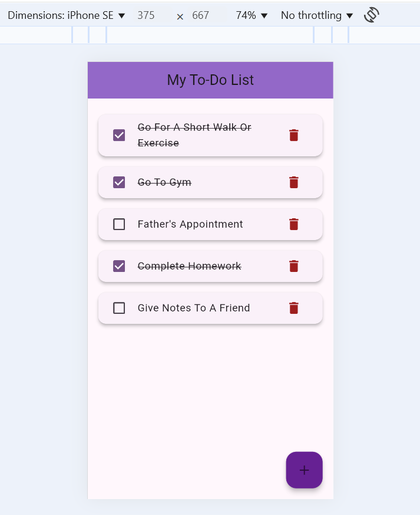
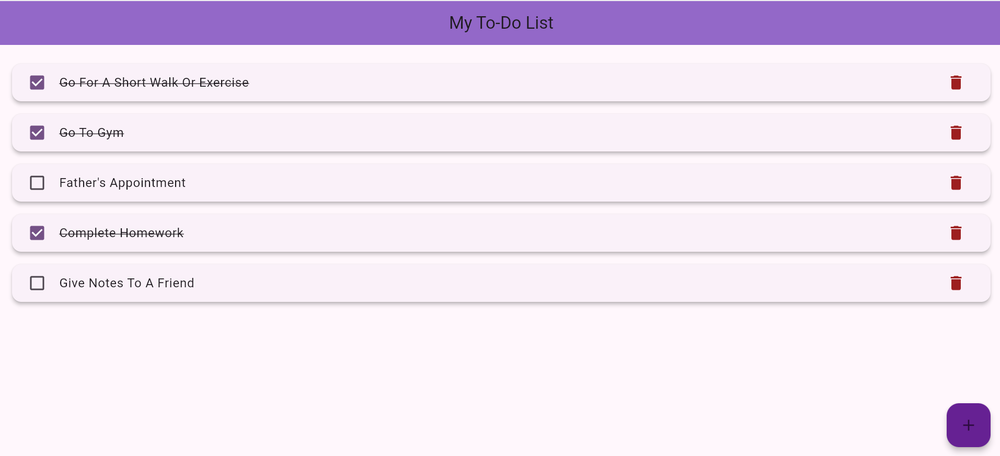

# Week3-assignment - Functional ToDo List - Group No. 4

## Group Members
- **Hamad Naseem** - 2280143  
- **Muhammad Bin Tariq** - 2280150

## About
This is a simple **functional ToDo List** application built using **Flutter**.

## Features
- Add new tasks dynamically
- Mark tasks as completed (checkbox)
- Delete tasks
- Custom widget for each ToDo item (only selected item rebuilds)
- Adaptive UI for both **landscape** and **portrait** orientations
- Clean and simple Material Design
- Light-weight, responsive layout

## Project Structure
- `lib/main.dart`: Main code of the application
- `assets/`: Contains screenshots
- `pubspec.yaml`: Project dependencies and assets declaration

## Screenshots

### Mobile View

### Web View

## How to Run
1. Clone the repository or download the ZIP
2. Open in **VSCode** / **Android Studio**
3. Run `flutter pub get`
4. Hit `F5` or use `flutter run`

## Requirements
- Flutter SDK
- Dart SDK 

A few resources to get you started if this is your first Flutter project:

- [Lab: Write your first Flutter app](https://docs.flutter.dev/get-started/codelab)
- [Cookbook: Useful Flutter samples](https://docs.flutter.dev/cookbook)

For help getting started with Flutter development, view the
[online documentation](https://docs.flutter.dev/), which offers tutorials,
samples, guidance on mobile development, and a full API reference.
